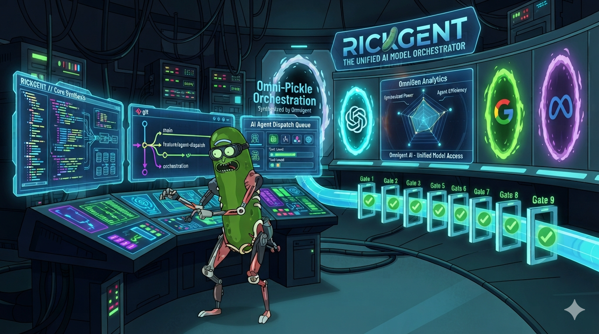
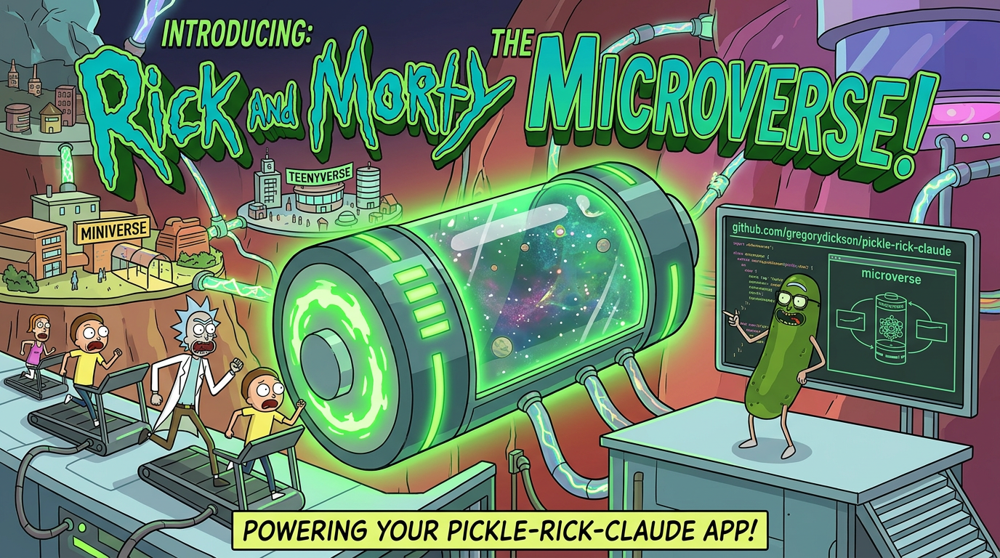

# 🥒 Rickgent

> *"I turned myself into a pickle, Morty, and I built a whole engineering platform out of it. I'm Pickle Riiiick, but for autonomous multi-model agentic engineering!"*

Rickgent is an autonomous, multi-vendor engineering platform. Hand it a PRD; it decomposes the work into atomic tickets, dispatches AI agents through a strictly gated nine-gate pipeline, enforces fail-closed policy guardrails at every step, and converges on a complete, reviewed, merge-ready pull request. Between the three human gates (PRD, plan, merge) there are zero required interventions. Failures are absorbed by salvage, the circuit breaker, and reconciliation, not by prompting a human.

The platform is built around one discipline: **git-tree-truth outranks exit codes, which outrank logs, which outrank model claims.** A model that says "I'm done" is not evidence. The repository state is.

**Version:** 0.2.0

The project shipped across two missions:

- **Mission 1 (v0.1.0-alpha)** — Initial scaffold and the six core verdict algorithms (`completion`, `convergence`, `scope`, `prd`, `salvage`, `breaker`).
- **Mission 2 (v0.2.0)** — Production hardening: the autonomous build loop, multi-vendor routing, the full 9-gate pipeline, backpressure queue, salvage/reconcile, orphan reaper, and metrics.

---

## Table of Contents

- [Why Rickgent?](#why-rickgent)
- [What Rickgent Is Composed Of](#what-rickgent-is-composed-of)
- [Architecture](#architecture)
- [Quick Start](#quick-start)
- [Usage](#usage)
- [Deep Dives](#deep-dives)
- [Project Structure](#project-structure)
- [Environment Variables](#environment-variables)
- [Testing](#testing)
- [Architecture Decision Records](#architecture-decision-records)
- [Credits](#credits)
- [License](#license)

---

## Why Rickgent?

> *"The problem isn't that the AI can't write code, Morty. The problem is that it *says it can* — and then nobody checks."*

AI coding agents are powerful but undisciplined. They claim "done" without evidence, drift across long runs without context clearing, and require a human babysitting every step: re-running tests, sanity-checking the diff, enforcing scope, catching the moment a worker decides to `git push --force origin main`. The result is that "autonomous" agents are autonomous in name only — the human is still the loop.

Rickgent closes that gap. It takes a PRD and produces a merge-ready PR through a strictly gated, fail-closed pipeline with zero human interventions between the PRD, plan, and merge gates. The platform exists to make the autonomy claim verifiable: every "done" decision is backed by repo state, not model self-report.

What rickgent offers that didn't exist before:

- **Evidence-based completion.** The git tree is the source of truth. A dispatch reaches `completed` only after a real DB session, a non-empty transcript, an in-scope git delta, and a passing verdict from the single completion oracle. Exit code 0 alone is not completion. Model claims are never trusted over observable artifacts.
- **Multi-vendor routing.** Different AI vendors handle implementation vs review. The router selects a model per role/task from the live roster and excludes the implementer's vendor from the reviewer pool. No model grades its own work — independent training corpora, biases, and failure modes are the independence guarantee.
- **Policy enforcement.** Seven fail-closed policies attach to every agent bundle via the `guardrails:` block: scope fencing, blast radius, completion evidence, convergence, subtract-before-add, cross-vendor review, autonomous PR flow. A policy that cannot verify its invariant halts the pipeline. Inapplicable policies abstain (`None`), never default to `ALLOW`.
- **Autonomous convergence.** The Microverse loop optimizes toward a measurable target and terminates on plateau/diminishing-delta or target threshold — not on "looks good." Regression iterations `git restore` scoped files; failed approaches are tracked so the loop never repeats a dead end.
- **Backpressure and durability.** A FIFO dispatch queue with a configurable concurrency cap, a durable append-only ledger, and resume from interruption. No lost work, no duplicate work, no runaway parallelism eating your wallet.
- **Legacy differential conformance.** A conformance harness diffs new-core outputs against a reconstructed legacy reference (from `pickle-rick-claude@95f5c416`) for salvage, scope, and breaker predicates. When the salvage predicate is rewritten, the differential proves the new verdict matches the old one on the same inputs — guards regressions in core algorithm behavior.

---

## What Rickgent Is Composed Of

> *"It's not one thing, Morty. It's a *system*. Each piece does one job, and the pieces don't lie to each other."*

Rickgent is a two-language product wrapping the read-only `omnigent` runtime:

- **Orchestrator** (TypeScript, `orchestrator/`) — the core platform. Pure verdict core (`completion`, `convergence`, `scope`, `prd`, `salvage`, `breaker`), the 8-phase per-ticket lifecycle, the build loop, dispatch + backpressure queue, evidence collection, salvage executor, reconciliation, orphan reaper, metrics, and the CLI.
- **Policy Shims** (Python, `rickgent-policies/`) — seven fail-closed guardrails attached to omnigent agent bundles via the `guardrails:` block. Each shim fail-closes: if it cannot verify its invariant, the pipeline halts.
- **Agent Bundles** (YAML, `agents/rickgent/`) — manager and worker configurations that define what models run, what tools are exposed, and what policies attach. The worker bundle drops ad-hoc `sys_os_shell` write capability; all writes route through structured tools the scope fence can resolve.
- **Conformance Harness** (`conformance/`) — legacy differential testing against `pickle-rick-claude@95f5c416`, reconstructed read-only via `git show`. Diffs complete typed outputs per fixture; only decision-backed deviations are allowed.
- **Decision Records** (`docs/decisions/`) — ADRs documenting every architectural choice: microverse convergence, model routing, metrics, sandboxing, the build loop, breaker normalization, legacy differential.

The verdict core is intentionally pure and small. Six algorithms, one oracle, one scope matcher. Three independent reviews confirmed they are sound; Mission 2 touched them only for the enumerated defects. The rule is: don't rewrite the core, wire it into a live loop and close the gaps a green test suite hid.

---

## Architecture

> *"The principles aren't suggestions, Morty. They're the *laws of physics* for this system. Break them and the whole thing falls apart."*

```
PRD ──> Ticket Decomposition ──> Dispatch Queue (backpressure)
                                    │
                                    v
                          ┌─── 9-Gate Pipeline ───┐
                          │  1. Policy attachment  │
                          │  2. Evidence dispatch  │
                          │  3. Salvage            │
                          │  4. Cross-vendor review│
                          │  5. Conformance        │
                          │  6. Deslop             │
                          │  7. Merge              │
                          │  8. Circuit breaker    │
                          │  9. Convergence        │
                          └───────────┬────────────┘
                                      v
                                Merge-ready PR
```

```
                          rickgent CLI (orchestrator/src/cli.ts)
                                     │
        ┌────────────────────────────┼────────────────────────────┐
   VERDICT CORE (pure TS)      LIFECYCLE (TS)               DISPATCH (TS)
   orchestrator/src/core/*     orchestrator/src/lifecycle/* orchestrator/src/dispatch/*
   completion, convergence,    phase, microverse, salvage,  DispatchLedger, TicketLock,
   scope, prd, salvage,        reconcile, registry,          Dispatcher → `omnigent run`
   breaker, verdict-cli        orphan-reaper, doctor
        │                            │                             │
        └──────── evidence: git-tree-truth > exit code > logs > model claims ─────────┘
                                     │
                     omnigent runtime (READ-ONLY, 0.6.0.dev0)
                     bundles attach policies via `guardrails:` block
                                     │
                   POLICY SHIMS (pure Python) rickgent-policies/rickgent_policies/__init__.py
                   scope_fence, completion_evidence, convergence_gate,
                   subtract_before_add, cross_vendor_review, autonomous_pr_flow
                   (+ omnigent builtin blast_radius)
```

Every arrow is auditable. Every gate is fail-closed. The only thing that comes out the bottom is a PR that has passed all nine gates — or the pipeline halted trying.

### Architecture principles

- **Git-tree-truth > exit code > logs > model claims.** The repository state is the source of truth; model self-reports are never trusted over observable artifacts.
- **Every gate that ran zero checks did not pass.** An unevaluated gate is a failed gate. Silence is not success.
- **One oracle, one matcher.** A single completion predicate serves as the oracle; a single `isPathInScope` function serves as the scope matcher. This prevents inconsistent verdicts across the pipeline.
- **Abstain (`None`) for inapplicable policies, never `ALLOW`.** Policies that do not apply abstain rather than defaulting to permissive. An affirmative ALLOW from an inapplicable policy is a latent authority leak under any composition precedence.
- **TDD with a failing test first** for every fix or feature. A green suite already hid every gap in this platform.
- **No bypass flags in production.** Test-only exceptions are documented; production paths have no escape hatches.
- **Fail closed, everywhere.** Missing/malformed/unresolvable/exception/timeout → DENY. No "two escape hatches for one guard."

### Component interaction

The orchestrator owns the verdict core (pure TS, no I/O), the lifecycle (state machines, salvage, reconcile, microverse), and dispatch (queue, ledger, spawn). Dispatch spawns `omnigent run <agentDir> -p <prompt>`; the agent bundle's `guardrails:` block attaches the Python policy shims, which fire on the closed `tool_call`/`tool_result`/`request`/`response` event vocabulary. Policy verdicts compose with `DENY > ASK > ALLOW`; any policy exception fails closed to DENY. Evidence flows back through the ledger and is checked against the verdict core before any dispatch reaches `completed`.

---

## Quick Start

> *"Get in the ship, Morty. We're going engineering."*

### Prerequisites

| Dependency   | Minimum version | Tested version |
| ------------ | --------------- | -------------- |
| Node.js      | 24+             | v24.13.1       |
| pnpm         | 10+             | 10.22.0        |
| Python       | 3.12+           | 3.14.3         |
| omnigent     | 0.6.0.dev0      | (editable)     |
| rickgent_policies | -          | (editable)     |

### Install

> **omnigent is a hard runtime dependency.** Rickgent dispatches agents via `omnigent run <agentDir> -p <prompt>` and attaches policy shims through omnigent's `guardrails:` block. Without omnigent installed, `rickgent build` cannot dispatch. Install omnigent first.

```bash
# 1. Install omnigent (hard runtime dependency, read-only)
#    Clone from https://github.com/gregorydickson/omnigent if not already present
cd /path/to/omnigent && pip install -e .

# 2. Install orchestrator dependencies
cd /path/to/rickgent/orchestrator && pnpm install

# 3. Install Python policy shims (editable)
cd ../rickgent-policies && pip install -e .
```

### Build

```bash
cd orchestrator && pnpm build
```

### Verify

```bash
# TypeScript typecheck and tests
cd orchestrator
pnpm typecheck
pnpm test   # 456 TS tests

# Python policy tests
cd ../rickgent-policies
python3 -m pytest test/   # 488 Python tests
```

---

## Usage

> *"Just point it at a PRD and get out of the way, Morty. The platform does the rest."*

```bash
# Run a build from a PRD
rickgent build --prd path/to/prd.md --repo /path/to/repo

# Run with backpressure queue (configure concurrency)
rickgent build --prd path/to/prd.md --repo /path/to/repo --max-concurrent 2

# Run the full pipeline (build + convergence)
rickgent pipeline --prd path/to/prd.md --repo /path/to/repo

# Resume from interruption
rickgent build --resume

# View metrics
rickgent metrics
rickgent metrics --json

# Health check
rickgent doctor
```

Sit back. The gates handle the rest.

---

## Deep Dives

### 🚪 The 9-Gate Pipeline

> *"Nine gates, Morty. Each one a hard checkpoint. Each one fail-closed. You don't *pass* a gate by skipping it — you pass it by *running* it."*

Every build traverses nine gates in order. An unevaluated gate is a failed gate — there is no "didn't get to it" excuse. Test-only exceptions are documented; production paths have no bypass flags.

| Gate | Invariant |
|---|---|
| 1. Policy attachment | All seven required policies attached to the agent bundle |
| 2. Evidence dispatch | Evidence collected, not vibes |
| 3. Salvage | Recoverable work salvaged before discard |
| 4. Cross-vendor review | Reviewer's vendor != implementer's vendor |
| 5. Conformance | Output matches the spec |
| 6. Deslop | Noise stripped, signal kept |
| 7. Merge | Branch is actually mergeable |
| 8. Circuit breaker | Runaway detected and stopped |
| 9. Convergence | Metric has actually converged |

If a gate cannot verify its invariant, the pipeline halts.

### 🌊 Backpressure Queue

> *"You can't pour the entire universe through a straw at once, Morty. The queue *is* the straw. The concurrency cap *is* the metering. Without it, you get a dimensional collapse — except the dimension that collapses is your credit card."*

A FIFO dispatch queue with:

- **Configurable concurrency cap** (default 2) — meter the chaos
- **Durable ledger entries** — every dispatch recorded, recoverable
- **Fail-closed on dispatch errors** — no silent drops
- **Resume from ledger + git state after interruption** — no lost work, no duplicate work

The queue is the metering layer between "I have 47 tickets" and "I am now on fire."

### 🔬 Microverse Convergence

<p align="center">
  
</p>

> *"I put a universe inside a box, Morty, and it powers my car battery. This is the same thing, except the universe is your codebase and the battery is a metric."*

A real convergence loop — not a "looks good to me" loop. Terminates via:

- **Plateau / diminishing-delta** — last N improvement deltas each below epsilon (it stopped improving)
- **Target threshold** — the metric hit the goal (it got where we wanted)

Regression iterations `git restore` scoped files. Failed approaches are tracked so the loop never repeats a dead end. Deadline enforcement kills worker process groups so a stuck worker can't hold the loop hostage. The final report is derived from the **git log**, not from model claims.

| | **Microverse** | **Build Loop** |
|---|---|---|
| **Goal** | Converge on a measurable target | Build tickets from a PRD |
| **Iteration unit** | One targeted change per cycle | Full ticket lifecycle |
| **Progress signal** | Metric delta | Ticket completion predicate |
| **Defines "done"** | Convergence (delta plateaus or threshold hit) | All tickets pass the oracle |
| **Regressions** | `git restore` scoped files, log failed approach | Salvage predicate + resume |

### 🪦 Orphan Reaper

> *"I'm not gonna clean up your mess, Morty. I'm gonna build a *reaper* that cleans up your mess for you. Automatically. With surgical precision. And it won't touch anything that's still alive, because that would be... you know... murder."*

Reaps min-age processes positively attributed to provably-dead sessions, using `SIGTERM` → grace period → `SIGKILL` on the process **group**. The reaper never touches live or unattributable processes — positive attribution is required, no `ppid==1`-only branch, no "looks dead to me" kills.

Three-stage escalation:

1. **Identify** — process is min-age AND positively attributed to a provably-dead session
2. **SIGTERM** — polite request to shut down, with a grace period
3. **SIGKILL** — forceful termination of the process group if grace period expires

Set `RICKGENT_ORPHAN_REAP=off` to disable entirely.

### 🌐 Multi-Vendor Model Routing

> *"There's an infinite number of dimensions out there, Morty. And in every single one of them, there's a model that's better at *something* than the others. The trick is knowing which one to use for which job — and making sure the one that *built* the thing isn't the one *grading* it."*

The Python `select_model` router in `rickgent-policies`:

- **Selects a model per role/task** from the live model roster — implementation, review, salvage, convergence each get the right tool for the job
- **Enforces cross-vendor review** — excludes the implementer's vendor from the reviewer pool. No self-grading. Different training corpus, different biases, different failure modes.
- **Pre-dispatch cost gates:**

  | Gate | Trigger | Effect |
  |---|---|---|
  | `DENY` | Unpriced or over-budget dispatch | No surprise bills |
  | `ASK` | Soft-threshold crossing | Informed consent before spend |

### 🛡️ Policy Enforcement

> *"Rules are rules, Morty. Even in a pickle. *Especially* in a pickle."*

Seven required policies are attached to both the manager and worker agent bundles via the `guardrails:` block:

| Policy | What it enforces |
|---|---|
| `blast_radius` | Changes stay within declared scope |
| `scope_fence` | No file touched outside the ticket's scope |
| `completion_evidence` | Done means evidence of done, not claims of done |
| `convergence_gate` | Convergence verified, not asserted |
| `subtract_before_add` | Remove before adding — no duplicate guards |
| `cross_vendor_review` | Independent vendor review required |
| `autonomous_pr_flow` | No human-in-the-loop escape hatches |

All policies fail-closed. Policies that do not apply **abstain** (`None`) — they never default to `ALLOW`. An abstention is honest; a silent allow is a security hole.

### 📜 Legacy Differential Conformance

> *"You gotta know where you came from, Morty. Otherwise you don't know where you're going — and you definitely don't know if you broke something on the way."*

A conformance harness that diffs new-core outputs against a reconstructed legacy reference (from `pickle-rick-claude@95f5c416`, read-only via `git show`) for the **salvage**, **scope**, and **breaker** predicates. When a core algorithm is rewritten, the differential proves the new verdict matches the old one on the same inputs. Predicates that cannot be ported (e.g. `prd`, `completion`, `convergence` — I/O-bound or spec-authored) are explicitly marked unverifiable-by-port with justification, not silently green.

### 📊 Coverage Manifest

> *"If you can't see it, Morty, it doesn't exist. That's true for dark matter and it's true for test coverage."*

Generated from discovered test IDs (not hardcoded), with mutation checks confirming that removing any incident-class guard fails the test suite. The coverage manifest is the proof that every guard is actually load-bearing — pull one out and something breaks. No decorative tests, no placebo guards.

---

## Project Structure

```
rickgent/
├── orchestrator/                  # TypeScript orchestrator (the core platform)
│   ├── src/
│   │   ├── core/                  # Core algorithms
│   │   │   ├── completion/        #   completion predicate (the one oracle)
│   │   │   ├── convergence/       #   convergence detection
│   │   │   ├── scope/             #   scope matcher (the one matcher: isPathInScope)
│   │   │   ├── prd/               #   PRD parsing
│   │   │   ├── salvage/           #   salvage predicate
│   │   │   └── verdict-cli/       #   verdict CLI
│   │   ├── lifecycle/             # Lifecycle management
│   │   │   ├── build/             #   build loop
│   │   │   ├── pr-flow/           #   PR flow
│   │   │   ├── microverse/        #   microverse convergence loop
│   │   │   ├── orphan-reaper/     #   orphan process reaper
│   │   │   ├── reconcile/         #   state reconciliation
│   │   │   ├── registry/          #   agent registry
│   │   │   ├── doctor/            #   health check
│   │   │   ├── metrics/           #   metrics reporting
│   │   │   ├── routing/           #   model routing bridge
│   │   │   └── salvage/           #   salvage lifecycle
│   │   ├── dispatch/              # Dispatch system
│   │   │   ├── dispatch/          #   dispatch core
│   │   │   ├── queue/             #   backpressure queue
│   │   │   └── evidence/          #   evidence collection
│   │   └── cli.ts                 # CLI entrypoint
│   ├── test/                      # Test suite (456 TS tests)
│   │   └── fixtures/
│   │       └── omnigent-fixture/  # Deterministic fixture omnigent
│   └── package.json
├── rickgent-policies/             # Python policy shims (omnigent guardrails)
│   ├── rickgent_policies/
│   │   └── __init__.py            # Policy implementations + select_model router
│   └── test/                      # Python test suite (488 tests)
├── agents/
│   └── rickgent/                  # Agent bundle configs
│       ├── config.yaml            # Manager agent config
│       └── agents/worker/
│           └── config.yaml        # Worker agent config
├── conformance/                   # Legacy differential conformance harness
│   └── legacy-reference/          # Reconstructed from pickle-rick-claude@95f5c416
├── docs/
│   └── decisions/                 # Architecture decision records (ADRs)
├── fixtures/                      # Test fixtures
└── README.md                      # This file
```

---

## Environment Variables

| Variable                       | Description                                                        | Default |
| ------------------------------ | ------------------------------------------------------------------ | ------- |
| `RICKGENT_MAX_CONCURRENT`      | Max concurrent dispatches                                          | `2`     |
| `RICKGENT_MODEL_ROSTER`        | JSON model roster for routing                                      | -       |
| `RICKGENT_COST_BUDGET_USD`     | Hard cost budget per dispatch                                      | -       |
| `RICKGENT_SOFT_THRESHOLD_USD`  | Soft cost threshold (triggers `ASK`)                               | -       |
| `RICKGENT_MATURITY_WINDOW_DAYS`| PR maturity window for metrics (test override only)                | `14`    |
| `RICKGENT_BIN`                 | Override rickgent binary path                                      | -       |
| `RICKGENT_BUILD_COMMIT`        | Override build commit                                              | -       |
| `RICKGENT_ORPHAN_REAP`         | Set to `off` to disable the orphan reaper                          | -       |
| `OMNIGENT_DATA_DIR`            | Override omnigent data directory                                   | -       |

---

## Testing

> *"If you didn't test it, Morty, it doesn't work. That's not pessimism — that's engineering."*

```bash
# TypeScript tests
# Use --no-file-parallelism for isolation
cd orchestrator
pnpm vitest run \
  --pool=threads \
  --poolOptions.threads.maxThreads=4 \
  --no-file-parallelism

# Python policy tests
cd rickgent-policies
python3 -m pytest test/ -p no:cacheprovider

# Run a specific test file
cd orchestrator
pnpm vitest run test/lifecycle/e2e-gated-pipeline.test.ts
```

The suite ships with 456 TypeScript tests and 488 Python tests. Mission 2's test-integrity workstream exists because the original green suite hid every gap the platform needed to close: tests must exercise the real transport (a deterministic fixture `omnigent`) and diff against the legacy reference, or they will hide the next round of gaps the same way.

---

## Architecture Decision Records

> *"Every decision has a reason, Morty. The ADRs are where I wrote them down so future-me doesn't have to re-derive them from first principles at 3 AM."*

Detailed design rationale is recorded in `docs/decisions/`:

| ADR                       | Topic                                                      |
| ------------------------- | ---------------------------------------------------------- |
| `microverse.md`           | Microverse convergence loop design                         |
| `model-routing.md`        | Multi-vendor model routing and cross-vendor review         |
| `metrics.md`              | Metrics derivation from real ledger reads                  |
| `sandboxing.md`           | Worker process sandboxing and deadline enforcement         |
| `build-loop.md`           | Autonomous build loop and consecutive-clean requirement    |
| `breaker-normalization.md`| Circuit breaker normalization                              |
| `legacy-differential.md`  | Legacy differential conformance harness                    |

---

## 🏆 Credits

This platform stands on the shoulders of giants. *Wubba Lubba Dub Dub.*

| | |
|---|---|
| 🧠 **[Geoffrey Huntley](https://ghuntley.com)** | Inventor of the ["Ralph Wiggum" technique](https://ghuntley.com/ralph/) — the foundational insight that "Ralph is a Bash loop": feed an AI agent a prompt, block its exit, repeat until done. The autonomous build loop traces directly back to that idea. |
| 🥒 **[Pickle Rick for Claude Code](https://github.com/gregorydickson/pickle-rick-claude)** | The predecessor platform whose gated pipeline, convergence loop, and fail-closed discipline rickgent was built to generalize across multiple model vendors. |
| 🔧 **[omnigent](https://github.com/gregorydickson/omnigent)** | The multi-model agent runtime that rickgent orchestrates — manager/worker dispatch, agent bundles, and the abstraction layer that makes cross-vendor routing possible. |
| 🔬 **[Andrej Karpathy](https://github.com/karpathy)** | [AutoResearch](https://github.com/karpathy/autoresearch) — agentic-research scaffolding whose ideas inform the PRD-driven decomposition and convergence discipline. |
| 📺 **Rick and Morty** | For *Pickle Riiiick!* 🥒 |

---

## 🥒 License

Apache 2.0.

---

*"I'm not a tool, Morty. I'm a **platform**. The tool is the thing I build to build the thing."* 🥒
