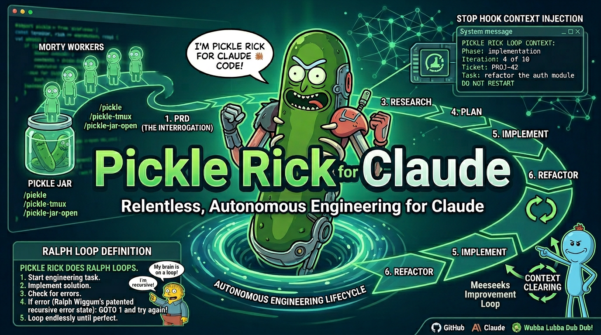

# 🥒 Rickgent

> *"I turned myself into a pickle, Morty, and I built a whole engineering platform out of it. I'm Pickle Riiiick, but for autonomous multi-model agentic engineering!"*

Autonomous multi-model engineering platform that takes a PRD and produces a merge-ready PR with zero human interventions. Rickgent dispatches AI agents (an omnigent manager plus one or more workers) through a strictly gated nine-gate pipeline, enforces policy guardrails at every step, and converges on a complete, reviewed, merge-ready pull request. The platform is built around a fail-closed, evidence-based discipline: **git-tree-truth outranks exit codes, which outrank logs, which outrank model claims.**

**Version:** 0.2.0

The project shipped across two missions:

- **Mission 1 (v0.1.0-alpha)** — Initial scaffold and core algorithms.
- **Mission 2 (v0.2.0)** — Production hardening, autonomous build loop, multi-vendor routing, and the full 9-gate pipeline.

---

## Table of Contents

- [How It Works](#how-it-works)
- [Quick Start](#quick-start)
- [Pipeline Flow](#pipeline-flow)
- [Tool Deep Dives](#tool-deep-dives)
- [Project Structure](#project-structure)
- [Setup](#setup)
- [Usage](#usage)
- [Testing](#testing)
- [Environment Variables](#environment-variables)
- [Architecture Principles](#architecture-principles)
- [Architecture Decision Records](#architecture-decision-records)
- [Credits](#credits)
- [License](#license)

---

## How It Works

> *"Morty, it's not about *doing* the work. It's about *engineering a system that does the work for you* while you sit on the couch and watch interdimensional cable."*

Six steps from PRD to merge-ready PR. Each step is independently auditable, each gate fail-closed, and the whole thing runs end-to-end with zero human in the loop.

### Step 1: PRD In

> *"The first rule of engineering, Morty: know what the hell you're building before you start building it."*

Hand rickgent a PRD. The PRD parser walks the document, extracts acceptance criteria, interface contracts, and scope boundaries, then decomposes the work into atomic tickets — each scoped to a single concern with machine-checkable completion criteria. No "best effort" tickets. No "looks done to me" tickets. Every ticket either passes the oracle or it doesn't.

### Step 2: Dispatch — Backpressure Queue

> *"You can't pour the entire universe through a straw at once, Morty. You need *backpressure*. You need to meter the chaos."*

Tickets enter a FIFO dispatch queue with a configurable concurrency cap (default 2). The queue keeps a durable ledger, fails closed on dispatch errors, and resumes from ledger + git state after interruption. No lost work, no duplicate work, no runaway parallelism eating your wallet alive.

### Step 3: Build Loop — The 9-Gate Pipeline

> *"Nine gates, Morty. Nine. Every single one fail-closed. It's like a prison for bad code, except the prison *is* the code review."*

Every build traverses nine gates, each one a hard checkpoint:

1. **Policy attachment verification** — all seven required policies attached to the agent bundle, or halt.
2. **Evidence dispatch** — collect evidence, not vibes.
3. **Salvage** — recover what's recoverable before throwing anything away.
4. **Cross-vendor review** — a different vendor's model reviews the implementer's work. No self-grading.
5. **Conformance gate** — does the output match the spec?
6. **Deslop gate** — strip the noise, keep the signal.
7. **Merge gate** — is this actually mergeable?
8. **Circuit breaker** — stop the runaway before it runs away with your budget.
9. **Convergence gate** — has the metric actually converged, or are we just saying it did?

### Step 4: Convergence — The Microverse

> *"I put a universe inside a box, Morty, and it powers my car battery. This is the same thing, except the universe is your codebase and the battery is a metric."*

A real convergence loop that terminates via plateau/diminishing-delta (last N deltas below epsilon) OR a target threshold. Regression iterations `git restore` scoped files — failed approaches don't pollute the tree. Deadline enforcement kills worker process groups so a stuck worker can't hold the loop hostage. The final report is derived from the git log, not from model claims. The model doesn't get to declare victory. The tree does.

### Step 5: Salvage & Resume

> *"Sometimes science is more art than science, Morty. But mostly it's about not throwing away perfectly good code just because the process crashed."*

When things fail — and they will — rickgent doesn't start over. The salvage predicate determines what's recoverable, the ledger tracks where we actually were (not where the model *thinks* we were), and `rickgent build --resume` picks up from the real state. Git-tree-truth outranks everything.

### Step 6: Metrics

> *"You can't improve what you don't measure, Morty. That's not a Rick quote, that's just... objectively true."*

`rickgent metrics` reports interventions per run and rolling matured-PR quality, both derived from real ledger reads — not hardcoded values, not model self-assessment. The numbers come from the ground truth, same as everything else.

---

## Quick Start

> *"Get in the ship, Morty. We're going engineering."*

### Install

```bash
# Install orchestrator dependencies
cd orchestrator && pnpm install

# Install Python policy shims (editable)
cd ../rickgent-policies && pip install -e .
```

### Build

```bash
cd orchestrator && pnpm build
```

### Verify

```bash
# TypeScript typecheck and tests
cd orchestrator
pnpm typecheck
pnpm test   # 456 TS tests

# Python policy tests
cd ../rickgent-policies
python3 -m pytest test/   # 488 Python tests
```

### Run

```bash
# Run a build from a PRD
rickgent build --prd path/to/prd.md --repo /path/to/repo

# Run the full pipeline (build + convergence)
rickgent pipeline --prd path/to/prd.md --repo /path/to/repo

# Resume from interruption
rickgent build --resume

# Check the numbers
rickgent metrics
```

Sit back. The gates handle the rest.

---

## Pipeline Flow

> *"It's not a pipeline, Morty. It's a *gauntlet*. Everything that comes out the other end has earned it."*

```
PRD ──> Ticket Decomposition ──> Dispatch Queue (backpressure)
                                    │
                                    v
                          ┌─── 9-Gate Pipeline ───┐
                          │  1. Policy attachment  │
                          │  2. Evidence dispatch  │
                          │  3. Salvage            │
                          │  4. Cross-vendor review│
                          │  5. Conformance        │
                          │  6. Deslop             │
                          │  7. Merge              │
                          │  8. Circuit breaker    │
                          │  9. Convergence        │
                          └───────────┬────────────┘
                                      v
                                Merge-ready PR
```

Every arrow is auditable. Every gate is fail-closed. The only thing that comes out the bottom is a PR that has passed all nine gates — or the pipeline halted trying.

---

## Tool Deep Dives

### 🚪 The 9-Gate Pipeline

> *"Nine gates, Morty. Each one a hard checkpoint. Each one fail-closed. You don't *pass* a gate by skipping it — you pass it by *running* it."*

Every build traverses nine gates in order. An unevaluated gate is a failed gate — there is no "didn't get to it" excuse. Each gate has a single, well-defined invariant:

| Gate | Invariant |
|---|---|
| 1. Policy attachment | All seven required policies attached to the agent bundle |
| 2. Evidence dispatch | Evidence collected, not vibes |
| 3. Salvage | Recoverable work salvaged before discard |
| 4. Cross-vendor review | Reviewer's vendor != implementer's vendor |
| 5. Conformance | Output matches the spec |
| 6. Deslop | Noise stripped, signal kept |
| 7. Merge | Branch is actually mergeable |
| 8. Circuit breaker | Runaway detected and stopped |
| 9. Convergence | Metric has actually converged |

If a gate cannot verify its invariant, the pipeline halts. No escape hatches in production. Test-only exceptions are documented; production paths have no bypass flags.

### 🌊 Backpressure Queue

> *"You can't pour the entire universe through a straw at once, Morty. The queue *is* the straw. The concurrency cap *is* the metering. Without it, you get a dimensional collapse — except the dimension that collapses is your credit card."*

A FIFO dispatch queue with:

- **Configurable concurrency cap** (default 2) — meter the chaos
- **Durable ledger entries** — every dispatch recorded, recoverable
- **Fail-closed behavior on dispatch errors** — no silent drops
- **Resume from ledger + git state after interruption** — no lost work, no duplicate work

The queue is the metering layer between "I have 47 tickets" and "I am now on fire." It keeps the fire out.

### 🔬 Microverse Convergence

<p align="center">
  
</p>

> *"I put a universe inside a box, Morty, and it powers my car battery. This is the same thing, except the universe is your codebase and the battery is a metric."*

A real convergence loop — not a "looks good to me" loop. Terminates via two conditions:

- **Plateau / diminishing-delta** — last N deltas below epsilon (it stopped improving)
- **Target threshold** — the metric hit the goal (it got where we wanted)

Regression iterations `git restore` scoped files. Failed approaches don't pollute the tree — they're tracked so the loop never repeats a dead end. Deadline enforcement kills worker process groups so a stuck worker can't hold the loop hostage. The final report is derived from the **git log**, not from model claims.

| | **Microverse** | **Build Loop** |
|---|---|---|
| **Goal** | Converge on a measurable target | Build tickets from a PRD |
| **Iteration unit** | One targeted change per cycle | Full ticket lifecycle |
| **Progress signal** | Metric delta | Ticket completion predicate |
| **Defines "done"** | Convergence (delta plateaus or threshold hit) | All tickets pass the oracle |
| **Regressions** | `git restore` scoped files, log failed approach | Salvage predicate + resume |

### 🪦 Orphan Reaper

> *"I'm not gonna clean up your mess, Morty. I'm gonna build a *reaper* that cleans up your mess for you. Automatically. With surgical precision. And it won't touch anything that's still alive, because that would be... you know... murder."*

Reaps min-age processes that are positively attributed to provably-dead sessions, using `SIGTERM` → grace period → `SIGKILL` on the process **group**. The reaper never touches live or unattributable processes. Positive attribution is required — no "looks dead to me" kills.

Three-stage escalation:

1. **Identify** — process is min-age AND positively attributed to a provably-dead session
2. **SIGTERM** — polite request to shut down, with a grace period
3. **SIGKILL** — forceful termination of the process group if grace period expires

The reaper is the cleanup crew that runs without supervision and never makes a mess of its own. Set `RICKGENT_ORPHAN_REAP=off` to disable it entirely.

### 🌐 Multi-Vendor Model Routing

> *"There's an infinite number of dimensions out there, Morty. And in every single one of them, there's a model that's better at *something* than the others. The trick is knowing which one to use for which job — and making sure the one that *built* the thing isn't the one *grading* it."*

The Python `select_model` router in `rickgent-policies`:

- **Selects a model per role/task** from the live model roster — implementation, review, salvage, convergence each get the right tool for the job
- **Enforces cross-vendor review** — excludes the implementer's vendor from the reviewer pool. No self-grading. The model that wrote the code never reviews the code.
- **Pre-dispatch cost gates:**
  - `DENY` on unpriced or over-budget dispatches — no surprise bills
  - `ASK` on soft-threshold crossings — informed consent before spend

Cross-vendor review is the independence guarantee. The reviewer comes from a different vendor than the implementer, which means a different training corpus, different biases, different failure modes. It's the closest thing to objective review you can get from LLMs.

### 🛡️ Policy Enforcement

> *"Rules are rules, Morty. Even in a pickle. *Especially* in a pickle."*

Seven required policies are attached to both the manager and worker agent bundles:

| Policy | What it enforces |
|---|---|
| `blast_radius` | Changes stay within declared scope |
| `scope_fence` | No file touched outside the ticket's scope |
| `completion_evidence` | Done means evidence of done, not claims of done |
| `convergence_gate` | Convergence verified, not asserted |
| `subtract_before_add` | Remove before adding — no duplicate guards |
| `cross_vendor_review` | Independent vendor review required |
| `autonomous_pr_flow` | No human-in-the-loop escape hatches |

All policies fail-closed. If a policy cannot verify its invariant, the pipeline halts. Policies that do not apply **abstain** (`None`) — they never default to `ALLOW`. An abstention is honest; a silent allow is a security hole.

### 📜 Legacy Differential Conformance

> *"You gotta know where you came from, Morty. Otherwise you don't know where you're going — and you definitely don't know if you broke something on the way."*

A conformance harness that diffs new-core outputs against a reconstructed legacy reference (from `pickle-rick-claude@95f5c416`) for salvage, scope, and breaker predicates. This guards against regressions in core algorithm behavior — when you rewrite the salvage predicate, the legacy differential proves the new one matches the old one's verdicts on the same inputs.

### 📊 Coverage Manifest

> *"If you can't see it, Morty, it doesn't exist. That's true for dark matter and it's true for test coverage."*

Generated from discovered test IDs (not hardcoded), with mutation checks confirming that removing any incident-class guard fails the test suite. The coverage manifest is the proof that every guard is actually load-bearing — pull one out and something breaks. No decorative tests, no placebo guards.

---

## Project Structure

```
rickgent/
├── orchestrator/                  # TypeScript orchestrator (the core platform)
│   ├── src/
│   │   ├── core/                  # Core algorithms
│   │   │   ├── completion/        #   completion predicate (the one oracle)
│   │   │   ├── convergence/       #   convergence detection
│   │   │   ├── scope/             #   scope matcher (the one matcher: isPathInScope)
│   │   │   ├── prd/               #   PRD parsing
│   │   │   ├── salvage/           #   salvage predicate
│   │   │   └── verdict-cli/       #   verdict CLI
│   │   ├── lifecycle/             # Lifecycle management
│   │   │   ├── build/             #   build loop
│   │   │   ├── pr-flow/           #   PR flow
│   │   │   ├── microverse/        #   microverse convergence loop
│   │   │   ├── orphan-reaper/     #   orphan process reaper
│   │   │   ├── reconcile/         #   state reconciliation
│   │   │   ├── registry/          #   agent registry
│   │   │   ├── doctor/            #   health check
│   │   │   ├── metrics/           #   metrics reporting
│   │   │   ├── routing/           #   model routing bridge
│   │   │   └── salvage/           #   salvage lifecycle
│   │   ├── dispatch/              # Dispatch system
│   │   │   ├── dispatch/          #   dispatch core
│   │   │   ├── queue/             #   backpressure queue
│   │   │   └── evidence/          #   evidence collection
│   │   └── cli.ts                 # CLI entrypoint
│   ├── test/                      # Test suite (456 TS tests)
│   │   └── fixtures/
│   │       └── omnigent-fixture/  # Deterministic fixture omnigent
│   └── package.json
├── rickgent-policies/             # Python policy shims (omnigent guardrails)
│   ├── rickgent_policies/
│   │   └── __init__.py            # Policy implementations + select_model router
│   └── test/                      # Python test suite (488 tests)
├── agents/
│   └── rickgent/                  # Agent bundle configs
│       ├── config.yaml            # Manager agent config
│       └── agents/worker/
│           └── config.yaml        # Worker agent config
├── conformance/                   # Legacy differential conformance harness
│   └── legacy-reference/          # Reconstructed from pickle-rick-claude@95f5c416
├── docs/
│   └── decisions/                 # Architecture decision records (ADRs)
├── fixtures/                      # Test fixtures
└── README.md                      # This file
```

---

## Setup

> *"You need the right tools before you can build the thing that builds the thing, Morty."*

### Prerequisites

| Dependency   | Minimum version | Tested version |
| ------------ | --------------- | -------------- |
| Node.js      | 24+             | v24.13.1       |
| pnpm         | 10+             | 10.22.0        |
| Python       | 3.12+           | 3.14.3         |
| omnigent     | 0.6.0.dev0      | (editable)     |
| rickgent_policies | -          | (editable)     |

### Install

```bash
# Install orchestrator dependencies
cd orchestrator && pnpm install

# Install Python policy shims (editable)
cd ../rickgent-policies && pip install -e .
```

### Build

```bash
cd orchestrator && pnpm build
```

### Verify

```bash
# TypeScript typecheck and tests
cd orchestrator
pnpm typecheck
pnpm test   # 456 TS tests

# Python policy tests
cd ../rickgent-policies
python3 -m pytest test/   # 488 Python tests
```

---

## Usage

> *"Just point it at a PRD and get out of the way, Morty. The platform does the rest."*

```bash
# Run a build from a PRD
rickgent build --prd path/to/prd.md --repo /path/to/repo

# Run with backpressure queue (configure concurrency)
rickgent build --prd path/to/prd.md --repo /path/to/repo --max-concurrent 2

# Run the full pipeline (build + convergence)
rickgent pipeline --prd path/to/prd.md --repo /path/to/repo

# Resume from interruption
rickgent build --resume

# View metrics
rickgent metrics
rickgent metrics --json

# Health check
rickgent doctor
```

---

## Testing

> *"If you didn't test it, Morty, it doesn't work. That's not pessimism — that's engineering."*

```bash
# TypeScript tests
# Use --no-file-parallelism for isolation
cd orchestrator
pnpm vitest run \
  --pool=threads \
  --poolOptions.threads.maxThreads=4 \
  --no-file-parallelism

# Python policy tests
cd rickgent-policies
python3 -m pytest test/ -p no:cacheprovider

# Run a specific test file
cd orchestrator
pnpm vitest run test/lifecycle/e2e-gated-pipeline.test.ts
```

---

## Environment Variables

| Variable                       | Description                                                        | Default |
| ------------------------------ | ------------------------------------------------------------------ | ------- |
| `RICKGENT_MAX_CONCURRENT`      | Max concurrent dispatches                                          | `2`     |
| `RICKGENT_MODEL_ROSTER`        | JSON model roster for routing                                      | -       |
| `RICKGENT_COST_BUDGET_USD`     | Hard cost budget per dispatch                                      | -       |
| `RICKGENT_SOFT_THRESHOLD_USD`  | Soft cost threshold (triggers `ASK`)                               | -       |
| `RICKGENT_MATURITY_WINDOW_DAYS`| PR maturity window for metrics (test override only)                | `14`    |
| `RICKGENT_BIN`                 | Override rickgent binary path                                      | -       |
| `RICKGENT_BUILD_COMMIT`        | Override build commit                                              | -       |
| `RICKGENT_ORPHAN_REAP`         | Set to `off` to disable the orphan reaper                          | -       |
| `OMNIGENT_DATA_DIR`            | Override omnigent data directory                                   | -       |

---

## Architecture Principles

> *"The principles aren't suggestions, Morty. They're the *laws of physics* for this system. Break them and the whole thing falls apart."*

The system follows a strict fail-closed, evidence-based discipline:

- **Git-tree-truth > exit code > logs > model claims.** The repository state is the source of truth; model self-reports are never trusted over observable artifacts.
- **Every gate that ran zero checks did not pass.** An unevaluated gate is a failed gate.
- **One oracle, one matcher.** A single completion predicate serves as the oracle; a single `isPathInScope` function serves as the scope matcher. This prevents inconsistent verdicts across the pipeline.
- **Abstain (`None`) for inapplicable policies, never `ALLOW`.** Policies that do not apply abstain rather than defaulting to permissive.
- **TDD with a failing test first** for every fix or feature.
- **No bypass flags in production.** Test-only exceptions are documented; production paths have no escape hatches.

### Policy Shims

Policies are implemented as Python shims (`rickgent-policies`) that attach to omnigent agent bundles. Each policy fail-closes: if it cannot verify its invariant, the pipeline halts. The seven required policies are attached to both the manager and worker bundles.

### Model Routing

The Python `select_model` router in `rickgent-policies` selects a model per role/task from the live model roster. Cross-vendor review excludes the implementer's vendor from the reviewer pool, ensuring independent verification. Pre-dispatch cost gates deny unpriced or over-budget work and prompt (`ASK`) on soft-threshold crossings.

---

## Architecture Decision Records

> *"Every decision has a reason, Morty. The ADRs are where I wrote them down so future-me doesn't have to re-derive them from first principles at 3 AM."*

Detailed design rationale is recorded in `docs/decisions/`:

| ADR                       | Topic                                                      |
| ------------------------- | ---------------------------------------------------------- |
| `microverse.md`           | Microverse convergence loop design                         |
| `model-routing.md`        | Multi-vendor model routing and cross-vendor review         |
| `metrics.md`              | Metrics derivation from real ledger reads                  |
| `sandboxing.md`           | Worker process sandboxing and deadline enforcement         |
| `build-loop.md`           | Autonomous build loop and consecutive-clean requirement    |
| `breaker-normalization.md`| Circuit breaker normalization                              |
| `legacy-differential.md`  | Legacy differential conformance harness                    |

---

## 🏆 Credits

This platform stands on the shoulders of giants. *Wubba Lubba Dub Dub.*

| | |
|---|---|
| 🧠 **[Geoffrey Huntley](https://ghuntley.com)** | Inventor of the ["Ralph Wiggum" technique](https://ghuntley.com/ralph/) — the foundational insight that "Ralph is a Bash loop": feed an AI agent a prompt, block its exit, repeat until done. The autonomous build loop traces directly back to that idea. |
| 🥒 **[Pickle Rick for Claude Code](https://github.com/gregorydickson/pickle-rick-claude)** | The predecessor platform whose gated pipeline, convergence loop, and fail-closed discipline rickgent was built to generalize across multiple model vendors. |
| 🔧 **[omnigent](https://github.com/gregorydickson/omnigent)** | The multi-model agent runtime that rickgent orchestrates — manager/worker dispatch, agent bundles, and the abstraction layer that makes cross-vendor routing possible. |
| 🔬 **[Andrej Karpathy](https://github.com/karpathy)** | [AutoResearch](https://github.com/karpathy/autoresearch) — agentic-research scaffolding whose ideas inform the PRD-driven decomposition and convergence discipline. |
| 📺 **Rick and Morty** | For *Pickle Riiiick!* 🥒 |

---

## 🥒 License

Apache 2.0.

---

*"I'm not a tool, Morty. I'm a **platform**. The tool is the thing I build to build the thing."* 🥒
